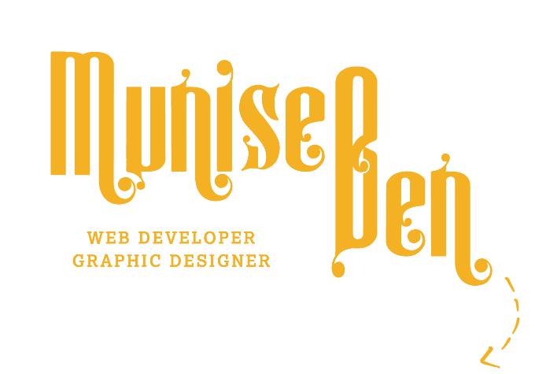

# 
### Oh Hi there, 
I have been into painting and writing from an early age. I completed my university education at Hacettepe University Faculty of Economics and Administrative Sciences in Ankara. During this whole process, I learned to use many digital design programs on my own. After graduation I had an opportunity to live and work in İstanbul as a designer. Now I live in Brussels. I decided to make everything digitally and I became a self-taught graphic designer. I have been learning software for a while. 

  1.   **WHAT AM I DOING?** 

🌱 I’m currently learning Web Dev in **Brussels BeCode**.

🤍 I am open to offers for **internship** in Belgium.

🌎 To review my work, please visit my website.

⚡ Visit my medium account for some of my written content.. 

   2.  **DEVELOPMENT STACK** 

      i. Graphic Design: - Photoshop - Illustrator - InDesign - Lightroom - CorelDraw - Procreate.
     ii. Web Development: - HTML CSS, Markdown, JavaScript. (Loading)
     ii. Backend Development: - PHP. (Loading)
    iii. Shell Scripting: - Bash programming.
     iv. 3D Design - Zbrush.
      v. UX/UI Design: - Adobe XD, Figma. (Loading)
 

  3.  **FUTURE VENTURES** 

    -  Maybe IOS developer
    -  Maybe Scrum Master
    -  Travel more, draw more and read more

  4.   **PART-TIME WORK** 
🌱 I am a freelance logo and corporate identity designer. **Reach me out**.

  5.   **LANGUAGES** 
|LANGUAGE|LEVEL|
|-|-|
| English | Professional |
| French | Intermediate |
| Turkish | Professional |

  6.  **REACH ME** 

  7.  **BUY ME A COFFEE** (milles merci!) 

            

 

